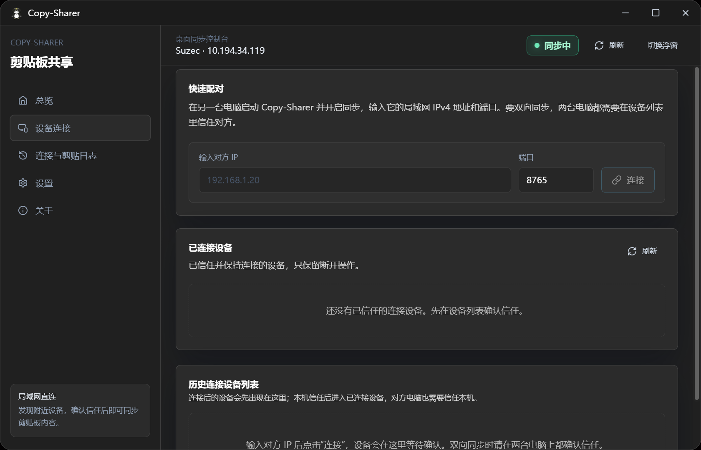

# Copy-Sharer

Copy-Sharer 是一款基于 WebSocket 实现的局域网剪贴板共享工具。两台电脑连接后，在其中一台电脑复制文本，另一台电脑可以自动收到并写入剪贴板。

适合在同一个 Wi-Fi、同一个路由器或同一个局域网环境里使用。

## 主要功能

- 在局域网内同步文本剪贴板。
- 手动输入对方电脑 IP 和端口连接。
- 显示同步状态、连接设备、最近同步内容。
- 支持文本、截图和图片剪贴板同步。
- 支持主控制面板和小浮窗切换。
- 小浮窗可显示连接状态、运行状态、延迟和最近剪贴板内容。
- 最近同步内容最多显示 5 条，并支持一键复制。
- 支持开机自启和启动后自动同步设置。

## 界面预览

### 总览面板


### 设备连接



## 下载安装

打包后的安装文件在：

```text
src-tauri\target\release\bundle\nsis\Copy-Sharer_2.0.0_x64-setup.exe
src-tauri\target\release\bundle\msi\Copy-Sharer_2.0.0_x64_en-US.msi
```

推荐普通用户使用 `Copy-Sharer_2.0.0_x64-setup.exe` 安装。

也可以直接运行：

```text
src-tauri\target\release\copy-sharer.exe
```

## 快速开始

1. 在两台电脑上都打开 Copy-Sharer。
2. 确认两台电脑在同一个局域网内。
3. 在其中一台电脑打开“设备连接”。
4. 输入另一台电脑的局域网 IP 地址。
5. 端口保持默认，或填写对方设置里的监听端口。
6. 点击“连接设备”。
7. 回到“总览”，点击“开始同步”。
8. 在任意一台电脑复制文本、截图或图片，另一台电脑即可同步收到。

## 如何查看本机地址

打开 Copy-Sharer 后，可以在主面板里看到本机地址。

如果暂时显示“等待网络地址”，请确认电脑已连接网络，然后点击刷新。

## 小浮窗

点击顶部的“切换浮窗”可以进入小浮窗模式。

小浮窗会显示：

- 当前是否启动同步。
- 已连接设备数量。
- 网络延迟状态。
- 最近剪贴板内容。

点击“小浮窗”里的“主面板”可以回到完整控制面板。

## 安全说明

- Copy-Sharer 面向局域网使用，不建议在公共网络或不可信网络中使用。
- 当前版本支持同步文本、截图和图片剪贴板。
- 剪贴板内容可能包含密码、验证码或隐私信息，使用前请确认连接设备可信。
- 连接陌生设备前，请先确认对方设备来源。
- 不需要同步时，可以点击“停止同步”。

## 常见问题

### 连接不上怎么办？

请检查：

- 两台电脑是否在同一个局域网。
- 对方电脑是否已经打开 Copy-Sharer。
- IP 地址是否填写正确。
- 端口是否和对方设置里的监听端口一致。
- Windows 防火墙是否拦截了应用。

### 为什么没有同步？

请检查：

- 主面板状态是否为“同步中”。
- 两台设备是否已经连接。
- 是否复制的是文本内容，或已经在设置中开启图片同步。
- 对方设备是否正在运行 Copy-Sharer。

### 浮窗能不能拖动？

可以。浮窗只支持拖动顶部区域，内容列表和按钮区域不会拖动窗口。

### 主窗口哪里可以拖动？

主窗口只支持拖动最上方标题栏。

## 当前版本

当前版本：`2.0.0`

当前版本重点支持局域网文本、截图和图片剪贴板同步。文件同步和跨网络同步暂未开放。
