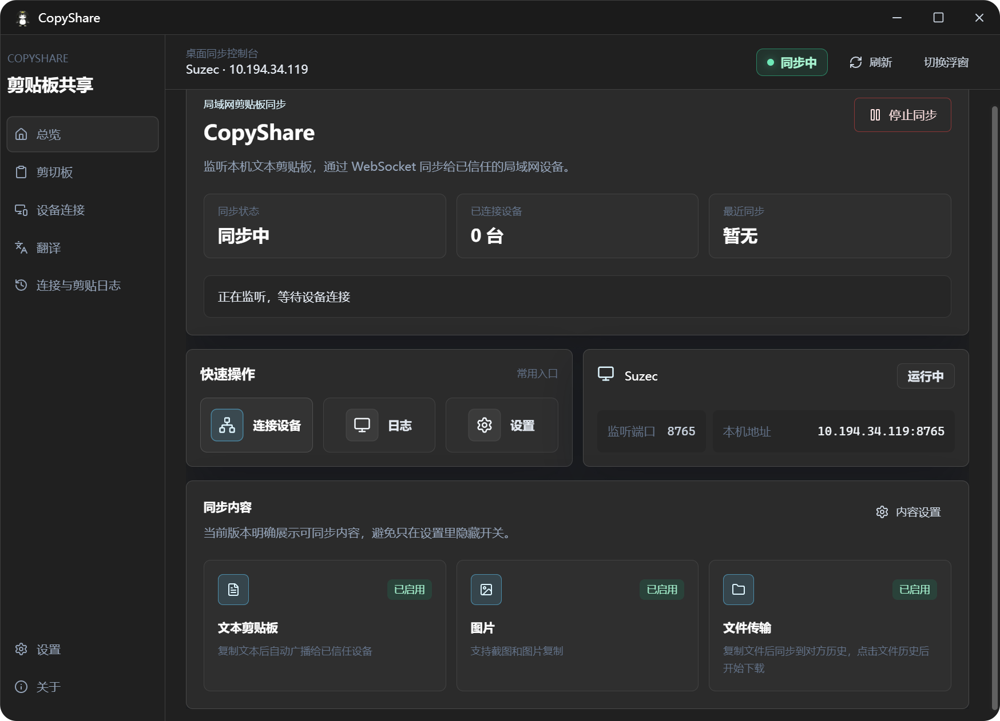
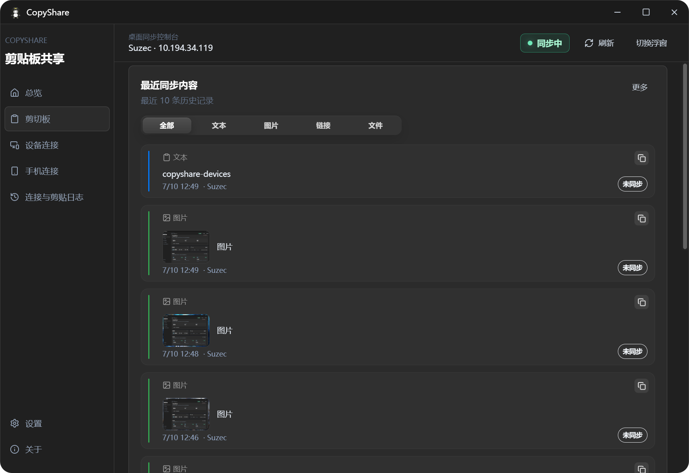
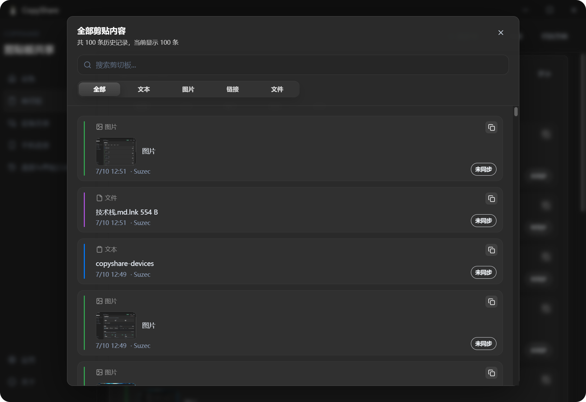
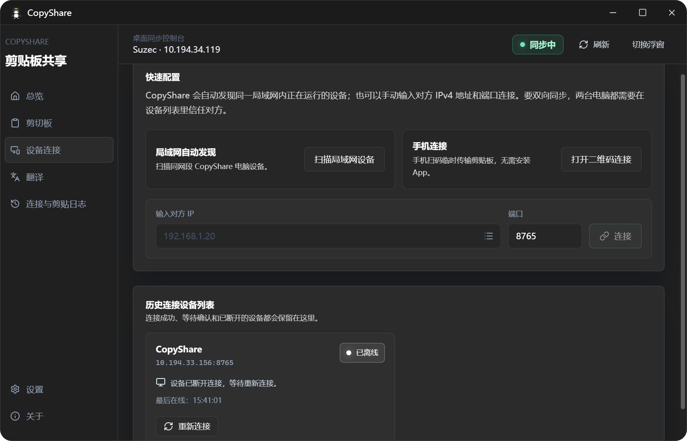
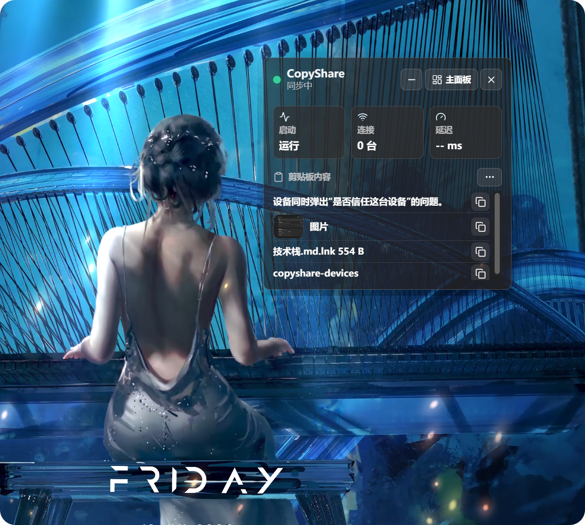

<div align="center">


# CopyShare

**面向局域网多设备办公的剪贴板同步与效率工具**

在已信任设备之间同步文本、截图、图片、文件和视频类剪贴板内容，并提供收藏夹、常用片段、本机 OCR、翻译、手机临时连接和桌面浮窗。

<p>
  
  
  
  
  
</p>

[下载最新版本](https://github.com/suzeccc/CopyShare/releases/latest)

</div>

## CopyShare 能做什么

CopyShare 适合办公室、宿舍、家庭等同一局域网内的多设备协作。设备互相信任后，在一台电脑上复制的内容可以同步到另一台电脑，无需部署公网服务器或 CopyShare 云端。

| 能力 | 说明 |
| --- | --- |
| 局域网剪贴板同步 | 同步文本、截图、图片、文件和视频类剪贴板内容 |
| 安全设备连接 | 自动发现或手动连接，双方确认信任后才开始同步 |
| 剪贴板管理 | 历史记录、搜索筛选、长文本展开、图片和视频预览 |
| 收藏与常用片段 | 长期收藏内容，创建高频文本片段，支持标签、备注和置顶 |
| 图片转文字 | 在 Windows 本机粘贴图片进行 OCR，不上传云端 |
| 翻译 | 内置 Google 翻译，也可接入自有 AI API |
| 手机临时连接 | 通过二维码让手机临时查看或发送文本 |
| 桌面快捷操作 | 桌面浮窗、系统托盘、通知、开机启动和自动同步 |

## 下载与平台选择

前往 [GitHub Releases](https://github.com/suzeccc/CopyShare/releases/latest) 下载适合设备的版本：

- **Windows x64**：适合绝大多数 Intel 或 AMD Windows 电脑。
- **Windows ARM64**：适合骁龙 X Elite、X Plus 等 ARM Windows 电脑。
- **macOS Apple Silicon**：适合 M1、M2、M3、M4 等 Apple 芯片 Mac。
- **macOS Intel**：适合 Intel 处理器 Mac。
- **Linux**：根据发行版选择 Release 中提供的安装包。

> [!NOTE]
> 图片转文字依赖 Windows OCR，目前仅支持 Windows。macOS 和 Linux 可以使用其他同步与效率功能，但 OCR 页面会提示当前平台不支持。

## 界面预览

### 桌面同步控制台

<p align="center">
  
</p>

### 最近同步内容

<p align="center">
  
</p>

### 全部剪贴内容

<p align="center">
  
</p>

### 设备连接

<p align="center">
  
</p>

### 桌面浮窗

<p align="center">
  
</p>

## 完整功能

### 局域网剪贴板同步

- 同步文本、截图、图片以及文件类剪贴板内容，视频作为文件同步。
- 可分别控制文本、图片和文件是否参与同步。
- 支持过滤重复同步内容，减少相同内容在设备间重复出现。
- 历史记录可显示创建时间、来源设备和同步状态。
- 可以关闭历史保存，仅同步当前内容而不继续记录新的历史。

### 剪贴板历史与媒体预览

- 首页展示最近同步内容，剪贴板页面提供完整历史窗口。
- 支持全部、文本、图片、链接和文件等分类筛选。
- 支持搜索历史内容，长文本可展开或收起。
- 链接可以直接使用系统默认浏览器打开。
- 图片支持大图预览和缩放查看。
- 支持本地视频预览；编码不受支持时可打开文件位置。
- 文件支持延迟下载、复制、下载状态提示和打开保存位置。
- 历史内容可以收藏或置顶，常用内容更容易找到。

### 收藏夹与常用片段

- 从剪贴板历史加入收藏夹后，内容不会随普通历史清理而消失。
- 可以新建、编辑和复制常用文本片段。
- 收藏支持自定义标题、标签和备注。
- 支持按内容类型、标签和关键词搜索筛选。
- 普通文本收藏可以转换为常用片段并继续编辑正文。
- 收藏内容和历史记录均可置顶，置顶收藏支持拖动排序。
- 内容区域支持网格和列表两种布局，选择会保存在本机。
- 显示收藏数量和本地存储占用，资源异常时给出提示。

### 设备连接与信任

- 自动发现同一局域网内运行中的 CopyShare 设备。
- 支持输入 IPv4 地址和端口手动连接，并保留最近连接地址。
- 新设备连接时双方需要确认信任，也可以拒绝连接。
- 支持主动断开设备和查看连接状态。
- 已信任设备重新出现时可以恢复可信连接。
- 展示设备在线状态、连接状态和网络延迟。

### 手机临时连接

- 电脑端生成临时二维码，手机浏览器扫码即可进入。
- 手机可以查看电脑当前提供的剪贴板文本。
- 手机可以向电脑提交文本并写入电脑剪贴板。
- 临时会话可手动关闭，关闭后二维码和会话失效。
- 手机与电脑需要处在能够互相访问的局域网中。

### 图片转文字

- 点击粘贴区域后按 `Ctrl+V`，可粘贴截图、位图或复制的图片文件。
- 图片在本机完成预处理和 Windows OCR，不会发送到云端。
- 显示图片预览、原始尺寸、识别状态和字符数量。
- 识别结果可以直接编辑、一键复制或清空。
- 可以再次粘贴新图片替换当前识别会话。
- 图片转文字目前仅支持 Windows，使用前需要系统中存在可用语言包。

### 翻译

- 输入或粘贴文本后选择目标语言进行翻译。
- 默认使用无需 API Key 的 Google 翻译通道。
- 可以切换到 AI 翻译并配置自有 API 地址、API Key 和模型。
- 支持中文、英语、日语、韩语、法语、德语、西班牙语等目标语言。
- 翻译结果可以一键复制，切换页面后会保留当前输入和结果。
- 设置中的翻译选项会根据 Google 或 AI 引擎显示相应配置。

### 文件传输与保存

- 可以选择单个或多个文件发送给已连接设备。
- 接收方可以接受或拒绝传输，进行中的任务可以取消。
- 文件任务显示等待、传输、完成或失败等状态。
- 可以修改文件保存目录、一键打开目录或恢复默认位置。
- 支持文件保存完成后自动打开所在文件夹。
- 历史文件可以直接打开本地保存位置；尚未下载时会先执行下载。

### 桌面浮窗与系统集成

- 桌面浮窗展示最近剪贴板内容，可快速复制并查看更多历史。
- 浮窗支持文本、图片、文件和媒体内容，图片与视频可打开独立预览窗口。
- 浮窗可以移动到鼠标所在屏幕附近，主窗口可以快速居中。
- 系统托盘显示运行状态，可打开主窗口、启动/停止同步或退出。
- 支持单实例运行，再次启动时会唤起已有窗口。
- 关闭按钮可以设置为每次询问、最小化到托盘或直接退出。

### 设置、通知和缓存管理

- 修改设备名称、监听端口和文件下载位置。
- 提供 Win11 深色、午夜玻璃、石墨白雾和清雅茶绿主题。
- 支持开机启动和启动后自动同步。
- 桌面通知可分别控制剪贴板、信任确认、设备上线/离线和同步异常提醒。
- 可以选择是否在通知中显示剪贴板内容预览，并发送测试通知。
- 支持保存或清理同步历史。
- 缓存管理会统计图片历史、图片缩略图和视频缩略图等本地占用，并支持清除缓存。
- 应用启动时可以检查新版本，也可以在关于页手动检查更新并打开发布页。

## 快速开始

1. 在两台设备上安装并打开 CopyShare，确保它们处在同一 Wi-Fi 或局域网。
2. 进入「设备连接」，等待自动发现；也可以手动填写对方 IP 和端口。
3. 双方确认信任请求。
4. 在任意一台设备复制文本、截图、图片或文件，另一台设备会收到同步内容。
5. 在「剪贴板」中搜索、筛选、展开或预览历史，也可以通过桌面浮窗快速复制。
6. 将长期使用的内容加入「常用片段」，设置标题、标签、备注或置顶。
7. 在 Windows 上进入「图片转文字」，点击粘贴区域并按 `Ctrl+V` 识别截图文字。
8. 需要临时使用手机时，在设备连接页面打开二维码会话。

## 隐私、安全与联网边界

- 剪贴板内容不会上传到 CopyShare 自有云端；剪贴板同步、收藏夹和 OCR 数据只在本机和已连接的局域网设备之间处理。
- 未信任设备不能参与剪贴板同步，请只信任自己或明确授权的设备。
- 手机临时会话关闭后失效，不应把临时二维码分享给不可信人员。
- 使用 Google 翻译或自定义 AI 翻译时，翻译文本会发送到所选择的翻译服务，请避免翻译敏感内容。
- AI API Key 使用用户自己的配置，请妥善保管。
- 启动检查更新和关于页检查更新会访问 GitHub Release API。
- 剪贴板可能包含密码、验证码或私人文件；处理敏感内容时可暂停同步或关闭对应内容类型。

## 常见问题

### 搜不到设备怎么办？

- 确认设备处在同一局域网，并且 CopyShare 已经启动。
- 检查系统防火墙是否允许 CopyShare 访问局域网。
- VPN、虚拟网卡、访客 Wi-Fi 和客户端隔离可能阻止自动发现。
- 尝试在「设备连接」中手动输入对方 IPv4 地址和监听端口。

### 已连接但内容没有更新怎么办？

- 确认双方已经完成信任，而不是停留在等待确认状态。
- 检查首页是否处于同步状态。
- 在设置中确认对应的文本、图片或文件同步开关已开启。
- 如果刚复制过相同内容，检查是否启用了重复同步内容过滤。

### 应该下载哪个安装包？

- 大多数 Windows 电脑选择 Windows x64。
- 骁龙 Windows 电脑选择 Windows ARM64。
- M 系列 Mac 选择 macOS Apple Silicon，老款 Intel Mac 选择 macOS Intel。
- Linux 用户根据发行版选择对应格式。

### 图片转文字不可用怎么办？

- 图片转文字仅支持 Windows。
- 确认剪贴板中是图片，而不是网页中的图片地址。
- 确认 Windows 已安装所需识别语言包。
- 图片过大时先缩小或裁剪后重试。

### 视频无法播放怎么办？

系统播放器不一定支持所有视频编码。CopyShare 会提示预览错误，此时可以打开文件位置并使用系统中的其他播放器查看。

### 接收的文件保存在哪里？

默认保存在系统下载目录下的 `CopyShare` 文件夹。可以在「设置 → 下载位置」中修改、打开或恢复默认目录。

### 手机扫码打不开怎么办？

- 确认手机和电脑处在同一局域网。
- 确认手机浏览器可以访问电脑的局域网 IP。
- 检查系统防火墙和路由器的设备隔离设置。
- 关闭旧会话后重新生成二维码。

## 开发

### 环境

- Node.js 与 npm
- Rust 工具链
- Tauri 2 所需的系统依赖

### 常用命令

```powershell
npm install
npm run tauri:dev
npm run build
npm run build:exe
npm run tauri:build
node --test tests/*.test.ts
```

- `npm run tauri:dev`：启动桌面开发模式。
- `npm run build`：执行 TypeScript 检查并构建前端。
- `npm run build:exe`：仅生成当前平台的主程序，不生成安装包。
- `npm run tauri:build`：生成当前平台安装包。
- `node --test tests/*.test.ts`：运行项目 Node 测试。

## 自动发布

GitHub Actions 的 Release 工作流会构建：

- Windows x64 NSIS 安装版
- Windows ARM64 NSIS 安装版
- macOS Apple Silicon
- macOS Intel
- Linux

Windows 工作流只生成 x64 和 ARM64 的 NSIS 安装版，不生成 MSI。正式版本和源代码请以 [GitHub Releases](https://github.com/suzeccc/CopyShare/releases/latest) 为准。

## 技术栈

- [Tauri 2](https://tauri.app/)：桌面应用与 Rust 后端
- [Vue 3](https://vuejs.org/)：前端界面
- [TypeScript](https://www.typescriptlang.org/)：前端类型系统
- [Pinia](https://pinia.vuejs.org/)：应用状态管理
- [Tailwind CSS](https://tailwindcss.com/)：界面样式

## 许可证

本项目基于 [MIT License](LICENSE) 开源。
