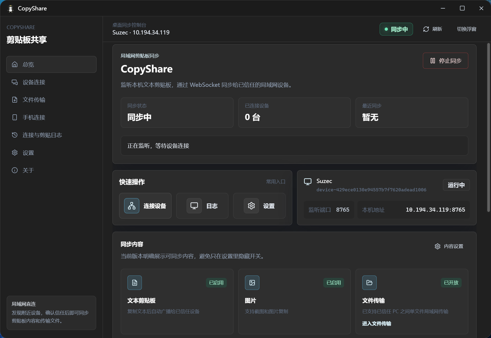
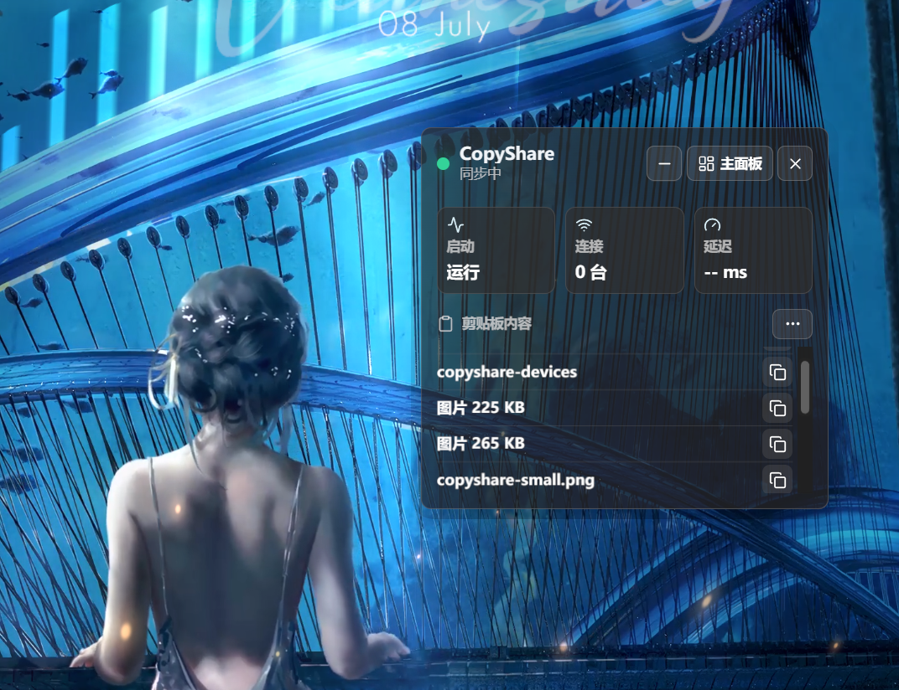

<div align="center">


# CopyShare

**局域网剪贴板同步工具**

不用公网，不走云端，在同一个局域网里同步文字、截图、图片和文件类剪贴板内容

<p>
  
  
  
  
  
</p>

<p>
  
  
  
</p>

</div>

## 适合谁用

- 经常在两台电脑之间复制文字、截图或图片。
- 不想把剪贴板内容传到云端。
- 希望手机临时给电脑发送文字，或从电脑取一段剪贴板内容。
- 在办公室、宿舍、家里局域网内使用多台设备。

## 主要功能

### 剪贴板同步

- 支持文本同步。
- 支持截图和图片同步。
- 支持文件类剪贴板内容复制与下载。
- 最近剪贴板历史会显示最近 10 条记录。
- 可按类型筛选：全部、文本、图片、链接、文件。

### 设备连接

- 自动发现同一局域网内的 CopyShare 设备。
- 支持手动输入 IP 和端口连接。
- 双方确认信任后才会同步内容。
- 可查看设备在线状态、连接状态和延迟。

### 手机临时连接

- 电脑生成二维码。
- 手机扫码后可临时查看电脑剪贴板内容。
- 手机也可以把文字提交到电脑剪贴板。
- 会话关闭后自动失效。

### 下载位置

设置页可以管理文件保存位置：

- 更改下载位置
- 打开下载文件夹
- 恢复默认位置

### 外观主题

内置多种主题：

- Win11 深色
- 午夜玻璃
- 石墨白雾
- 清雅茶绿

## 界面预览

### 总览



### 设备连接


### 小浮窗



## 安装

Windows 用户可使用安装包：

- `CopyShare_2.9.0_x64-setup.exe`
- `CopyShare_2.9.0_x64_en-US.msi`

如果只是临时使用，也可以直接运行：

- `CopyShare.exe`

## 快速开始

### 1. 在两台电脑上打开 CopyShare

确保两台电脑连接到同一个局域网。

### 2. 连接设备

进入「设备连接」页面。

可以等待自动发现，也可以手动输入对方电脑的 IP 和端口。

### 3. 信任设备

连接后，双方都需要确认信任。

只有互相信任后，剪贴板同步才会开始工作。

### 4. 开始复制

在任意一台电脑复制文字、截图或图片，另一台电脑会自动收到。

可以在「剪贴板」页面查看最近同步内容。

## 常见问题

### 搜不到设备怎么办？

请检查：

- 两台电脑是否在同一个 Wi-Fi 或局域网。
- 对方是否已经打开 CopyShare。
- Windows 防火墙是否允许 CopyShare 访问专用网络。
- 是否连接了 VPN、虚拟网卡或隔离网络。
- 可尝试手动输入对方 IP 和端口。

### 连接成功但不同步怎么办？

请检查：

- 双方是否都已信任设备。
- 首页状态是否为同步中。
- 对方设备是否仍在线。
- 防火墙是否拦截了局域网连接。

### 文件保存在哪里？

默认保存到系统下载目录下的 CopyShare 文件夹。

也可以在「设置」页面的「下载位置」中修改。

### 手机扫码打不开怎么办？

请检查：

- 手机和电脑是否在同一个局域网。
- 手机浏览器是否能访问电脑局域网 IP。
- Windows 防火墙是否允许 CopyShare。

## 安全说明

- CopyShare 面向局域网使用。
- 不需要公网服务器。
- 不会把剪贴板内容上传到云端。
- 未信任设备不能接收剪贴板内容。
- 剪贴板可能包含密码、验证码或隐私内容，请只信任自己的设备。

## 当前版本

当前版本：`v2.9.0`

本版本重点：

- 新增独立剪贴板页面。
- 最近历史显示 10 条。
- 新增 macOS 风格主题。
- 新增下载位置设置。
- 优化图片预览、文件类剪贴板、设备连接和历史记录体验。

## 开发者

```bash
npm install
npm run dev
npm run build
npm run tauri:build
```

常用命令：

- `npm run dev`：启动前端开发服务
- `npm run tauri:dev`：启动桌面开发模式
- `npm run build`：构建前端
- `npm run build:exe`：生成单个 exe
- `npm run tauri:build`：生成安装包
