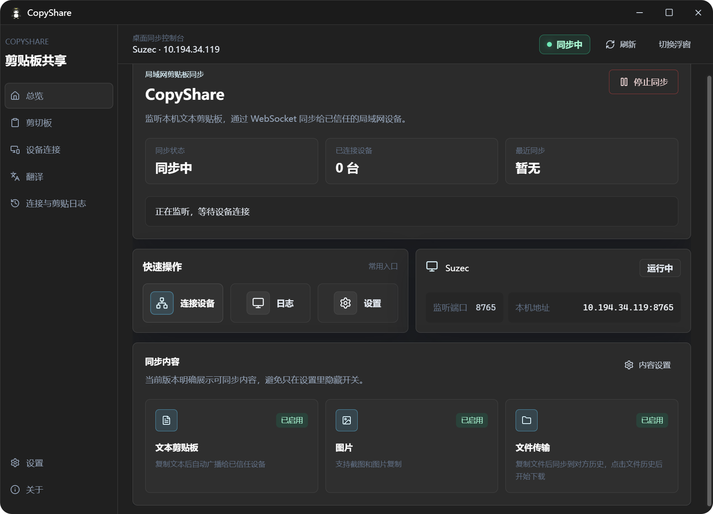
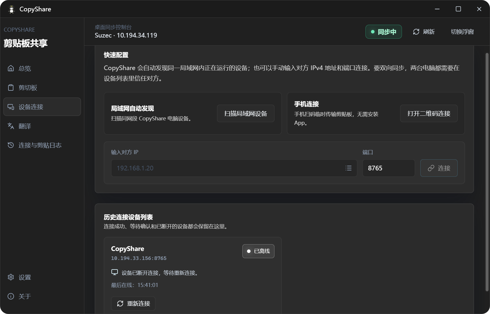
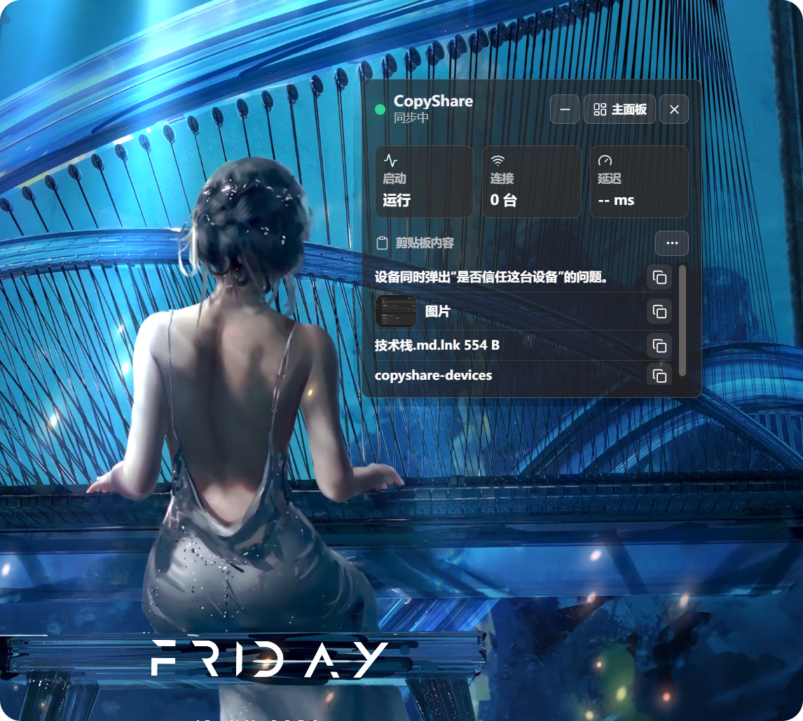

<div align="center">


# CopyShare

**LAN clipboard sync, file transfer, and content productivity for multiple devices**

Sync text, screenshots, images, and files between trusted computers. Download large files on demand with resumable transfers, and keep clipboard history, snippets, local OCR, translation, temporary mobile access, and a desktop floating panel close at hand.

[](https://github.com/suzeccc/CopyShare/releases/latest)
[](https://github.com/suzeccc/CopyShare/actions/workflows/release.yml)

[](LICENSE)

<p><a href="./README.md">简体中文</a> · <strong>English</strong></p>

[Download the latest release](https://github.com/suzeccc/CopyShare/releases/latest) · [Quick start](#quick-start) · [Privacy and security boundaries](#privacy-and-security-boundaries)

</div>

## Why CopyShare

CopyShare is designed for trusted LANs in offices, dorms, and homes. It does not depend on a CopyShare cloud service: after two devices trust each other, they can exchange clipboard content and files directly.

| Capability | Experience |
| --- | --- |
| Reliable multi-device sync | Automatically discovers trusted devices and forms a sync mesh; deterministic ordering, deduplication, and bounded delivery queues reduce reordering, loops, and slow-peer buildup |
| On-demand large-file downloads | The receiver sees a file entry first and downloads it when needed; tasks support pause, retry, and resume after an application restart |
| Content organization | Search and filter clipboard history, keep important items in the library, or turn them into editable, pinnable, sortable snippets |
| Local productivity tools | Local image OCR, Google or custom AI translation, QR-based mobile access, and image/video previews |
| Fast desktop access | Floating panel, five configurable global shortcuts, tray controls, desktop notifications, autostart, and automatic sync |
| Diagnosable LAN connectivity | Checks listeners, discovery, network profile, and firewall state; Windows can create private-network inbound rules for the current executable |

## Quick start

1. Install and open CopyShare from [GitHub Releases](https://github.com/suzeccc/CopyShare/releases/latest). The first-run wizard guides you through device name, download folder, automatic sync, and autostart.
2. Make sure two or more computers can reach each other on the same LAN.
3. Open **Devices** and wait for automatic discovery. If discovery fails, enter the other device's IPv4 address and listening port (default `8765`).
4. Approve the trust request on both sides. Previously trusted devices reconnect automatically and join the sync mesh when they return.
5. Copy text, a screenshot, an image, or files. Text and images sync according to your settings; files appear in the receiving application and are saved only after download.

> [!TIP]
> If a device cannot be found, open **Settings → Network diagnostics** first. It checks sync, discovery and mobile ports, the Windows network profile, and firewall rules, then provides specific guidance. For the full walkthrough, see the [user guide](docs/用户指南.md).

## Downloads and platforms

Open [GitHub Releases](https://github.com/suzeccc/CopyShare/releases/latest) and choose the package for your system:

| Platform | Intended devices |
| --- | --- |
| Windows x64 | Most Intel or AMD Windows computers |
| Windows ARM64 | ARM Windows computers such as Snapdragon X Elite and X Plus devices |
| macOS Apple Silicon | Macs with M1, M2, M3, M4, or later Apple silicon |
| macOS Intel | Intel-based Macs |
| Linux | Choose the package format provided for your distribution |

> [!NOTE]
> OCR uses the Windows system OCR engine on Windows, Apple Vision on macOS, and the bundled Simplified Chinese and English Tesseract fast models in official Linux packages. Each package contains only the OCR backend required by that platform.

## Interface preview

<table>
  <tr>
    <td width="50%" align="center"><strong>Sync dashboard</strong><br></td>
    <td width="50%" align="center"><strong>Clipboard history</strong><br></td>
  </tr>
  <tr>
    <td width="50%" align="center"><strong>Device connections</strong><br></td>
    <td width="50%" align="center"><strong>Library and snippets</strong><br></td>
  </tr>
</table>

<p align="center">
  <strong>Desktop floating panel / quick panel</strong><br>
  
</p>

## Core features

### Clipboard sync and multi-device reliability

- Sync text, screenshots, images, and file clipboard content; videos are handled as files.
- Enable or disable text, image, and file sync independently, and choose whether to filter duplicate content.
- Trusted devices reconnect automatically and form a multi-device sync mesh without manual pair-by-pair maintenance.
- Concurrent updates converge through a stable version order, and already applied messages are not forwarded again into loops.
- Each peer uses a bounded control queue and latest-clipboard coalescing, so a slow device cannot grow the send queue without bound.
- History entries show time, source device, and sync status; history saving can be disabled and existing history can be cleared.

### File transfer and resume

- After one or more files are copied, the receiver first gets file metadata and a download entry. Large files are not fully loaded into memory or written into the receiver clipboard automatically.
- Downloads are per file: choosing one item downloads only that file, not the rest of the batch.
- Transfers use streaming I/O and HTTP Range. Interrupted downloads keep completed bytes and can auto-retry, pause, or continue.
- Both sender and receiver can resume from a valid checkpoint after restart. If the source file changes, checksum validation fails, or authorization expires, the task stops instead of appending bad data.
- Download tokens are bound to the receiving device, offset, and expiry, and are consumed once for their intended use.
- A batch can contain at most **100** files. There is no separate per-file ceiling; send and receive share the total task size limit.
- The hard application limit is **10 GiB total size per task**, so a single-file transfer is also capped at 10 GiB.
- You can change the download folder, open it, restore the default location, and choose whether to open the folder when a download completes.

> [!NOTE]
> File transfer uses sender uplink and receiver downlink at the same time. Actual speed depends on NICs, Wi-Fi or Ethernet, disks, and LAN congestion on both sides.

### Clipboard history, library, and media previews

- Filter by all, text, image, video, link, or file, and search by keyword.
- Expand long text, open links in the system browser, and zoom images on a fixed preview canvas.
- Local videos support thumbnails and a dedicated preview window; if the system cannot decode a codec, open the file location instead.
- History items can be favorited or pinned; favorites are not deleted when ordinary history is cleared.
- Favorites support titles, tags, notes, and search, and can be converted into reusable text snippets.
- Snippets support create, edit, copy, pin, and drag-and-drop ordering.
- The library can switch between grid and list layouts and reports local storage use.

### Global shortcuts and desktop integration

Shortcuts can be enabled, remapped, and restored individually. If a binding conflicts or fails to register, the previous working configuration is kept.

| Action | Default shortcut | Default state |
| --- | --- | --- |
| Show/hide quick panel | `Alt+Shift+V` | Enabled |
| OCR clipboard image | `Alt+Shift+O` | Disabled |
| Translate clipboard text | `Alt+Shift+T` | Disabled |
| Open snippets | `Alt+Shift+B` | Disabled |
| Pause/resume sync | `Alt+Shift+S` | Disabled |

- The quick panel supports arrow-key selection, `Enter` to copy, and `Esc` to close.
- The tray can open the main window, start or stop sync, or quit the app.
- Closing the main window can ask every time, minimize to the tray, or quit immediately. The native close button and `Alt+F4` use the same policy.
- Desktop notifications, single-instance launch, autostart, and automatic sync after launch are supported.

### Network diagnostics and Windows firewall

- Checks the sync TCP port, UDP discovery port, and temporary mobile access port.
- Shows listener state, LAN addresses, Windows network profile, and private-network firewall status.
- Inspects firewall rules needed for sync, discovery, and mobile access, then provides actionable guidance.
- On Windows, **Repair firewall** only creates private-network inbound rules for the current CopyShare executable. It does not automatically change a public network profile to private.
- VPNs, virtual adapters, guest Wi-Fi, and router client isolation can still block discovery and connections.

### OCR, translation, and temporary mobile access

- In **Image to text**, paste a screenshot, bitmap, or image file. Preprocessing and OCR run locally; results can be edited, copied, or cleared.
- Google Translate needs no API key. AI translation accepts your own API endpoint, API key, model, and optional proxy.
- The computer can generate a temporary QR code. A phone browser can scan it to view text from the computer or submit text back.
- Mobile sessions can be closed manually; the QR code and session become invalid immediately.
- The UI supports Simplified Chinese and English, and the choice is saved in local configuration.

### Settings, notifications, sync log, and cache

- Configure device name, listening port, theme, sync content types, file size limits, download folder, and close behavior.
- Themes include Win11 Dark, Midnight Glass, Graphite Mist, and Tea Green.
- Desktop notifications can be controlled separately for clipboard, trust confirmation, file transfer, device state, and sync errors, with a real test notification.
- **Sync log** records transfer direction, content type, device, size, status, and errors without showing clipboard body text. Filter by all, issues, devices, or files, and resume recoverable file tasks from the log.
- Configuration writes are serialized. If a save is blocked or fails, the UI reverts to the last successful configuration so the interface does not drift from disk.
- Cache management reports local use for image history, thumbnails, and video thumbnails, and can clear cache.
- Startup checks for updates silently. **About** downloads and verifies signed updates, then installs and restarts after confirmation. Manually install an updater-enabled package once; future updates need no GitHub download page.

## Privacy and security boundaries

- Clipboard content is not uploaded to a CopyShare-owned cloud. Sync, library, and OCR data stay on the local machine and connected LAN devices.
- Device trust limits who can participate in sync, but it is not an end-to-end encrypted channel suitable for the public internet or untrusted shared networks. Use it only on trusted LANs and only trust devices you intentionally authorize.
- Temporary mobile sessions become invalid after they are closed. Do not share the QR code with untrusted people.
- When using Google Translate or custom AI translation, the text is sent to the selected translation service. Do not submit sensitive content to external translation services.
- AI API keys are stored in your own local configuration. Use a dedicated key and manage it carefully.
- Update checks and downloads use GitHub Releases. Other LAN sync features do not depend on a CopyShare cloud.
- Clipboards may contain passwords, verification codes, and private files. Pause sync or disable the relevant content types before handling sensitive material.

## FAQ

### What if a device cannot be discovered?

1. Confirm both sides have CopyShare running and are on a mutually reachable LAN.
2. Open **Settings → Network diagnostics** and follow the port, network profile, and firewall results.
3. Temporarily rule out VPN, virtual adapters, guest Wi-Fi, and client isolation.
4. In **Devices**, enter the other device's IPv4 address and listening port manually (default `8765`).

For the full troubleshooting order, see [Troubleshooting](docs/故障排查.md).

### Why do files not appear directly in the receiver clipboard?

This is expected. The receiving application shows a file entry first and saves the file only after the user downloads it. That design prevents unconfirmed large files from automatically consuming disk, network, and memory. Incomplete tasks can resume when conditions recover.

### How many files can one transfer include?

A batch can contain at most **100** files, and the total task size cannot exceed **10 GiB**. With a single file, that file is effectively capped at 10 GiB; with multiple files, the combined size is counted.

### What if devices are connected but content does not update?

- Confirm both sides finished trust, rather than still waiting for approval.
- Check that sync is running and that the text, image, or file switches are enabled.
- If the same content was just copied, check whether duplicate-content filtering is enabled.
- Inspect the sync log and desktop notifications for the specific error, then run network diagnostics.

### What if a video cannot be previewed?

Desktop media capabilities do not support every codec. CopyShare keeps the file entry and surfaces the preview error so you can open the file location and use another player.

### Where are received files saved?

By default they are saved under the system Downloads folder in a `CopyShare` directory. You can change, open, or restore that location in **Settings → Download location**; the first-run wizard can also choose the save folder.

## Development and builds

### Requirements

- Node.js and npm
- Rust stable toolchain
- [Tauri 2 system prerequisites](https://v2.tauri.app/start/prerequisites/)

### Common commands

```powershell
npm install
npm run tauri:dev
npm run build
npm run build:exe
npm run tauri:build
node --test tests/*.test.ts
cd src-tauri
cargo test
```

| Command | Purpose |
| --- | --- |
| `npm run tauri:dev` | Start desktop development mode |
| `npm run build` | Run TypeScript checks and build the frontend |
| `npm run build:exe` | Build the current-platform main executable without installers |
| `npm run tauri:build` | Build current-platform installers |
| `node --test tests/*.test.ts` | Run Node behavior and structure tests |
| `cargo test` | Run Rust backend tests |

For the full quality gates, package verification, and release checklist, see [Testing and builds](docs/测试与构建.md).

## Stack and release

- [Tauri 2](https://tauri.app/) + Rust: desktop runtime, LAN communication, file transfer, and system integration
- [Vue 3](https://vuejs.org/) + TypeScript + Pinia: UI, routing, and frontend state
- [Tailwind CSS](https://tailwindcss.com/): interface styling

A `v*` tag or manual run of the [Release workflow](.github/workflows/release.yml) builds Windows x64/ARM64 NSIS, macOS Apple Silicon/Intel, and Linux packages, then creates a draft GitHub Release. Use [GitHub Releases](https://github.com/suzeccc/CopyShare/releases/latest) as the source of truth for published versions.

## Project documentation

| Document | Audience | Contents |
| --- | --- | --- |
| [User guide](docs/用户指南.md) | Users | First run, device connections, synchronization, file transfers, and settings |
| [Troubleshooting](docs/故障排查.md) | Users and support | Network, trust, synchronization, file, OCR, and desktop integration issues |
| [Development guide](docs/开发指南.md) | Developers | Environment, repository layout, call paths, migrations, and conventions |
| [Testing and builds](docs/测试与构建.md) | Developers and releasers | Quality gates, local builds, bundles, and release checks |
| [Architecture and extension points](docs/架构与扩展点.md) | Developers | Module boundaries, data flow, persistence recovery, and security invariants |
| [LAN protocol](docs/局域网协议.md) | Developers | Discovery, trust, clipboard, file transfer, and resume protocol |

## License

CopyShare is released under the [MIT License](LICENSE).
