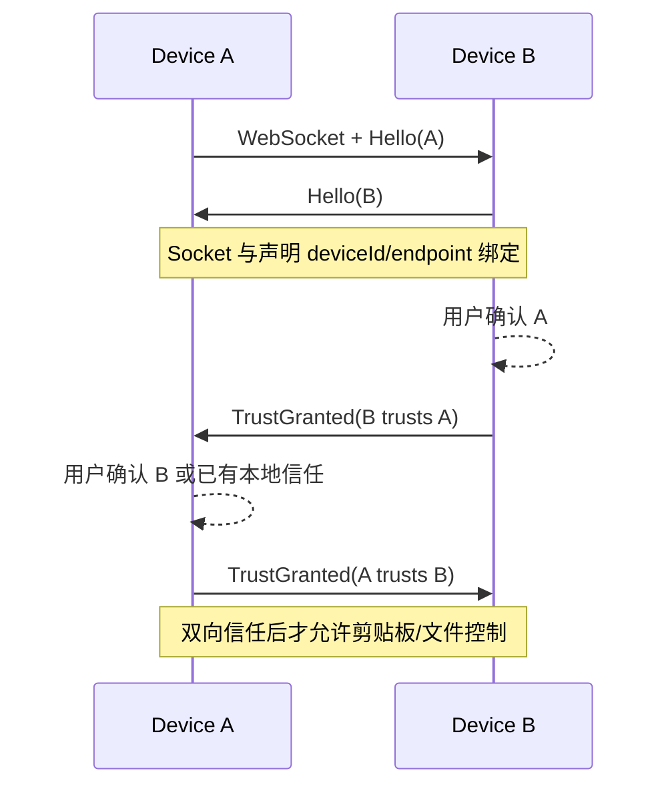

# CopyShare 局域网协议

> 文档导航：[用户指南](用户指南.md) · [故障排查](故障排查.md) · [开发指南](开发指南.md) · [测试与构建](测试与构建.md) · [架构与扩展点](架构与扩展点.md)

本文记录 CopyShare 3.4 当前实现的局域网互操作协议。协议面向同版本 CopyShare 客户端，不承诺兼容第三方软件。

## 1. 设计原则

- 无中心服务器：发现、同步和文件下载都在局域网端到端完成。
- 默认不信任：发现设备不等于允许读取或写入剪贴板。
- 向后兼容：新增可选字段使用 serde 默认值；可选能力通过 `Hello.capabilities` 协商。
- 最终一致：剪贴板事件使用 HLC 版本和设备 ID 排序，重复投递不会反复写入系统剪贴板。
- 文件可恢复：元数据控制消息与 HTTP 数据流分离，下载可按精确 offset 继续。

协议当前是局域网明文传输，不提供端到端加密。只应在受信任网络使用；设备互信用于阻止未确认客户端进入业务通道，不替代网络层加密。

## 2. 通道

| 通道 | 默认地址 | 用途 |
| --- | --- | --- |
| UDP discovery | `0.0.0.0:8764` | announce/request、网段扫描、离线检测 |
| WebSocket | 可配置，默认 TCP `8765` | Hello、信任、剪贴板、心跳、文件控制 |
| HTTP file stream | 与 WebSocket 共用监听端口 | `GET /file-transfer?...`、Range 下载 |

同步监听器先查看 TCP 前缀：`GET /file-transfer` 进入文件 HTTP 处理，其余连接按 WebSocket 握手处理。

## 3. UDP 发现

发现报文是 camelCase JSON：

```json
{
  "type": "copyshare-discovery",
  "version": 1,
  "deviceId": "device-...",
  "deviceName": "Office PC",
  "host": "192.168.1.10",
  "port": 8765,
  "appVersion": "3.4.0",
  "timestamp": 1780000000,
  "action": "announce",
  "scanRanges": ["192.168.1.0/24"]
}
```

- `action=announce` 表示上线/心跳公告，`request` 要求收到方单播回应。
- 客户端每 8 秒公告；30 秒未见标为离线，每 5 秒执行一次过期扫描。
- 主动发现包含三轮 request、当前真实网卡网段扫描和用户保存的私有 CIDR。
- 公网、回环、虚拟/不可用网卡和不合法 payload 会被拒绝。
- `scanRanges` 只接受规范化后的私有网段，并去重合并到本机配置。

发现只创建“可见设备”，不会自动授予剪贴板或文件权限。

## 4. WebSocket 信封

控制消息是 JSON，使用 `type` 字段区分 variant，字段采用 camelCase。主要消息：

| type | 方向 | 作用 |
| --- | --- | --- |
| `hello` | 双向 | 声明 deviceId/name、监听端口、版本、能力和是否要求手动确认 |
| `trustGranted` / `trustRejected` | 双向 | 建立或拒绝双向信任 |
| `clipboard` | 双向 | 文本、PNG base64 或文件列表剪贴板事件 |
| `ping` / `pong` | 双向 | 存活与延迟测量 |
| `fileOffer` | 发送端→接收端 | 文件批次、每文件哈希/大小/token、下载地址 |
| `fileAccept` / `fileReject` | 接收端→发送端 | 接收决策 |
| `fileProgress` | 双向 | 单文件与批次进度 |
| `fileComplete` / `fileCancel` / `fileError` | 双向 | 终态或错误 |
| `fileResumeRequest` / `fileResumeGrant` | 接收端↔发送端 | 按文件 offset 获取新的下载授权 |

未知或无法解析的消息不会改变业务状态，并记录为同步错误。

## 5. 身份与信任



- 本地 `trustedDevices` 只保存稳定 device ID，不把临时 endpoint 当作设备身份。
- 手动连接可以强制本轮重新确认，防止同 IP/端口被另一设备占用后继承信任。
- 收到剪贴板、file offer、resume 或完成消息时，再次检查当前连接与消息中的 device ID 是否一致。
- 拒绝会清理当前连接的待确认状态，不把首次出现且未信任的设备保留成可信历史。

## 6. 剪贴板事件

`clipboard` 包含：

- `messageId`：全局事件 ID，用于投递去重。
- `sourceDeviceId` / `sourceDeviceName`：来源身份与展示名。
- `contentType`：`text`、`image`、`fileList`。
- `content` 与 `contentHash`：正文和“类型 + NUL + 正文”的 SHA-256。
- `timestamp`：兼容旧客户端的秒级时间。
- `originSequence`：来源设备单调序号。
- `eventVersion`：`physicalMs + logical + originDeviceId` 的 HLC 版本。

排序规则依次比较 HLC 物理时间、逻辑计数、来源 device ID，最后用 message ID 稳定决胜。旧消息没有 `eventVersion` 时，用 `timestamp × 1000`、逻辑值 0 和来源设备构造兼容版本。

客户端还维护三组有界集合：已见 message ID、远端写入后的 watcher 回声、已成功同步的内容哈希。每组最多 1024 项，避免常驻进程无限增长。

## 7. 文件传输

### 7.1 Offer 与逐文件选择

- 一个剪贴板批次最多 100 个文件、总量最多 10 GiB。
- `fileOffer.files[]` 每项含稳定 `fileId`、清洗前展示名、大小、SHA-256、可选缩略图和首次 token。
- UI 把批次拆成逐文件历史卡片；底层任务仍保留一个 batch，避免多次剪贴板事件互相覆盖。
- 接收端快照记录 `requestedFileIds`，worker 只消费用户点选的文件。一个文件完成不会误把整个批次标为完成。

### 7.2 HTTP 下载

下载请求使用 `/file-transfer`，查询参数绑定 transfer、file、token 和接收设备。服务端验证：

1. 当前任务和文件存在且未取消。
2. token 未使用、未过期。
3. token 绑定当前接收 device ID 和精确 offset。
4. 源文件大小、修改时间和 SHA-256 没有变化。

首次下载返回 `200 OK`；断点下载要求 `Range: bytes=<offset>-` 并返回 `206 Partial Content`。offset 与授权不一致、源文件变化或完整响应错误覆盖断点时，接收端拒绝继续拼接。

接收端写入 `<final>.<ext>.part`，每 8 MiB 或 1 秒持久化检查点，每 200 ms 最多发送一次 UI 进度。最终大小和 SHA-256 通过后再进入完成状态。

### 7.3 断点续传

`file-resume-v1` capability 表示支持：

1. 接收端根据 `.part` 实际长度发送 `fileResumeRequest(files[{fileId, offset}])`。
2. 发送端重新验证源文件，为该 file/receiver/offset 发放单次新 token。
3. 接收端收到 `fileResumeGrant` 后按相同 offset 请求 Range。
4. 网络瞬时失败自动重试 3 次；随后暂停并保留 `.part`，用户可手动继续。

应用重启时，传输快照与磁盘实际长度对账；最终文件已完整则恢复为完成，`.part` 超过声明长度则暂停而不是盲目追加。

## 8. 兼容策略

- 旧 Hello 缺少 `manualTrustRequired`、`capabilities` 时按安全默认处理。
- 旧 Clipboard 缺少 sequence/HLC 时使用 timestamp 回退。
- 旧传输快照缺少 `requestedFileIds` 时：Pending 批次保持未选择；已经 Accepted/Transferring/Retrying 的旧任务迁移为请求全部未完成文件。
- 新能力必须先通过 `capabilities` 协商；不能让旧客户端把未知字段当作授权。
- Wire 字段重命名或删除属于破坏性协议变更，必须提升协议/能力版本并保留迁移测试。

## 9. 安全边界

- 协议不执行远端传来的路径；最终名称由本地清洗和冲突策略决定。
- token 不是永久链接，不能持久化成下次启动仍有效的下载凭据。
- `fileComplete` 可以报告合法文件子集，但未知 ID、重复 ID 或哈希不匹配会失败。
- 剪贴板正文仅在互信连接上处理；同步日志只保存脱敏元数据。
- 网络报文、文件名和错误文本都不能直接拼接成命令行或脚本执行。
