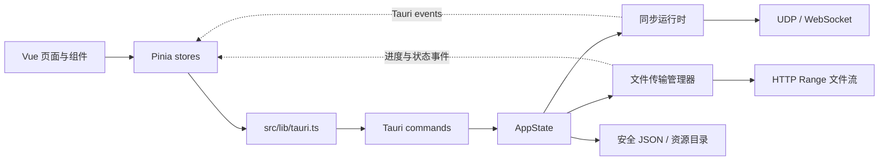

# CopyShare 架构与扩展点

> 文档导航：[用户指南](用户指南.md) · [故障排查](故障排查.md) · [开发指南](开发指南.md) · [测试与构建](测试与构建.md) · [局域网协议](局域网协议.md)

本文描述 CopyShare 3.4 的当前代码边界。它是实现约束，不是未来重写方案；修改同步、传输或持久化代码时，应先保持这里列出的安全与兼容不变量。

## 1. 运行时结构



- Vue 只通过 `src/lib/tauri.ts` 调用桌面能力，不直接访问文件系统或网络。
- `commands.rs` 是命令入口，负责参数语义和跨模块编排；长期状态统一进入 `AppState`。
- Rust 运行时通过 Tauri events 推送状态，前端 store 负责订阅、合并和页面生命周期。
- 所有局域网输入都视为不可信数据。身份、字段、路径、大小和哈希必须在 Rust 层验证。

## 2. Rust 模块职责

| 模块 | 职责 | 不应承担 |
| --- | --- | --- |
| `models.rs` | 前后端及局域网共享的数据契约 | 文件 I/O、网络连接 |
| `state.rs` | 配置、设备、历史、连接和同步引擎的并发状态 | UI 文案布局 |
| `discovery.rs` | UDP 发现、主动扫描、离线过期 | 建立信任、发送剪贴板 |
| `network.rs` | 端点规范化、网卡选择、Wire JSON 编解码 | 业务状态迁移 |
| `sync_engine.rs` | 内容哈希、HLC 排序、去重、回声抑制 | Socket、Tauri event、磁盘写入 |
| `sync.rs` | WebSocket 生命周期、握手、心跳、信任和剪贴板编排 | 文件路径策略 |
| `file_transfer_paths.rs` | 文件名清洗、保存目录、冲突命名、`.part` 路径 | 下载 worker、网络鉴权 |
| `file_transfer_http.rs` | HTTP 头、Range 和响应元数据解析 | 任务持久化 |
| `file_transfer.rs` | offer、授权、下载 worker、断点续传、状态事件 | 通用 JSON 事务 |
| `safe_json_store.rs` | 单文件 JSON 的刷盘、备份、恢复、损坏隔离 | 业务迁移和字段默认值 |
| `config.rs` / `device_store.rs` / `history.rs` | 业务数据迁移与快照语义 | 重复实现原子替换 |
| `library.rs` | 收藏资源事务、内容寻址和资源回收 | 剪贴板同步状态 |
| `translator.rs` | 翻译请求与按引擎、代理配置复用 HTTP 客户端 | 持久化 API Key 或重复维护设置状态 |

网卡枚举统一使用 `if-addrs`，本机地址选择保留现有多网卡、虚拟适配器和相邻网段评分。枚举无法选出 IPv4 时使用标准库 UDP `connect` 查询到目标或默认外部地址的系统路由，不发送数据包。

AI 和 Google 翻译各保留一个共享 HTTP 客户端，分别保持 30 s 和 15 s 超时；Google 的显式代理配置改变时替换缓存，API 地址、Key 和请求正文仍逐次设置。客户端创建错误不会覆盖已有缓存。空代理时系统代理由客户端自动获取，操作系统代理在外部改变后需要重建客户端或重启应用。

发布配置保留 Cargo 默认设置。2026-09-17 的 Windows 实测中，Thin LTO 与调试信息剥离组合增加 EXE 体积且提高构建成本，因此没有保留这组设置。内存较小的机器可通过 `CARGO_BUILD_JOBS` 降低构建并发。

## 3. 启动顺序

1. Tauri 注册单实例、剪贴板、通知、目录选择、快捷键和开机启动插件。
2. `AppState::load_from_disk` 加载配置、设备历史、剪贴板历史与收藏库。
3. 文件传输管理器恢复未完成快照并核对 `.part`/最终文件长度。
4. 创建托盘、启动剪贴板监控和 UDP 发现。
5. 配置允许时启动 WebSocket 同步监听。
6. Vue 刷新状态、设备、配置、历史，再安装事件订阅。
7. 全新安装在启动遮罩结束后显示首次连接向导；旧配置迁移到 v11 时自动标记为已完成。

剪贴板监控保留 450 ms 检查周期：Windows 使用系统序列号，macOS 使用 `NSPasteboard.changeCount`，计数未变化时跳过内容读取。没有可用计数的平台在 PNG/Base64 编码前比较尺寸与 RGBA 的 SHA-256 指纹，仅保留 32 字节指纹；仍需读取和散列原始像素。读取失败或内容类型开关变化时清除监控缓存，允许后续重新读取。

## 4. 数据与崩溃恢复

### 单文件 JSON

`config.json`、`devices.json` 和 `history.json` 使用 `safe_json_store`：

1. 序列化到 `<name>.tmp`，写完后调用 `sync_all`。
2. 旧目标改名为 `<name>.bak`。
3. 临时文件原子改名为目标；失败时把备份恢复回来。
4. 启动时目标缺失，优先提升完整临时文件，其次恢复备份。
5. 无法解析的目标保留为 `<name>.corrupt[.N]`，应用使用安全默认值继续启动。

收藏库和传输快照包含额外的资源/版本协调，继续使用各自的专用事务实现，但遵守相同原则：先持久化可恢复状态，再发布内存状态。

### 资源目录

- 历史图片和缩略图与 `history.json` 的保留集合同步清理。
- 历史图片正文保留在原有 `.b64` 资源中，启动只加载元数据；复制、收藏和缩略图按需读取。旧版内联图片先落盘再释放，缺少内容哈希的图片补齐哈希后保存元数据。
- 历史保存、置顶和清理在阻塞任务中串行执行；图片使用临时文件刷盘并替换，未变更资源不重复写入。JSON 提交成功后才回收失效资源，保存成功后才释放内存图片正文。
- JSON 提交后的历史资源回收失败会记录警告并在下次保存重试，避免已提交的磁盘元数据与内存状态分歧。
- 收藏文件按内容哈希存储，删除最后一个引用后才回收资源。
- 收藏大文件通过 64 KiB 缓冲计算哈希并写入临时资源，读回校验后提交；复制文件使用系统复制并流式核验目标，失败清理新建缓存。
- 接收文件先写 `.part`，哈希与大小通过后再成为最终文件。
- 传输快照保存选择的文件 ID、断点字节数和任务状态；临时下载地址/token 不作为可长期复用凭据。

## 5. 前端边界

- `App.vue` 只管理全局初始化和全局弹层；主窗口布局留在 `AppShell.vue`。
- 首次向导复用 `AppConfig`、`update_config` 和 `select_transfer_save_dir`，不维护第二套设置模型。
- Store 的事件订阅必须可重复调用且可释放；窗口/页面卸载时清理 unlisten 回调。
- 悬浮模式的系统剪贴板历史刷新检查窗口原生可见性和最小化状态；隐藏后在下一次检查停止 1200 ms 定时器，窗口恢复焦点时检查可见性并重启。失去焦点但仍可见时继续刷新，快捷键显式打开剪贴板面板仍允许按需读取。
- 用户文本、文件名、路径和剪贴板正文不进入翻译目录；需要时使用 `data-i18n-ignore`。

## 6. 安全不变量

以下条件不能为了简化 UI 或协议而绕过：

- 剪贴板和文件控制消息只接受来自“本机信任 + 对端确认信任”的连接。
- 连接声明的设备 ID 必须绑定到当前 Socket；不能只按 IP 推断身份。
- 文件 token 单次使用，并绑定 transfer、file、接收设备、offset 和有效期。
- 文件名必须经过 `sanitize_file_name`，最终路径必须由保存目录策略生成。
- 文件完成必须核对声明大小和 SHA-256；失败保留可恢复状态或明确清理临时文件。
- 去重集合、历史、设备和已完成任务都有容量上限，不能改成无限增长。

## 7. 常见扩展点

### 新增配置项

1. 同时修改 Rust/TypeScript `AppConfig`。
2. 为 Rust 字段增加 serde 默认值。
3. 提升 `CURRENT_CONFIG_VERSION`，在 `migrate_config` 保护老用户语义。
4. 更新前端默认配置、设置 UI、i18n 和迁移测试。

### 新增 WireMessage

1. 在 `models.rs` 增加带 serde 默认值的向后兼容字段或新 variant。
2. 在 `sync.rs::handle_wire_text` 验证连接身份后分发。
3. 如果旧端应忽略而不是失败，使用 capability 协商。
4. 增加序列化回环、身份伪造和旧消息缺字段测试。

### 新增持久化 JSON

1. 业务模块负责默认值、迁移和容量策略。
2. 单文件状态使用 `safe_json_store`，不要直接 `fs::write` 覆盖主文件。
3. 对大二进制资源使用独立目录，JSON 只保存引用和校验信息。
4. 覆盖中断写入、损坏文件、备份恢复和资源清理测试。

### 新增文件传输状态

同时审查 `FileTransferStatus`、单文件状态、快照恢复、前端映射、活动日志和终态清理。批次状态不能掩盖单文件未完成状态。

## 8. 验证命令

```powershell
node --test tests/*.test.ts
npm run build
cd src-tauri
cargo check
cargo test
```

发布/本地打包前必须执行完整集合，而不是只运行新增测试。
